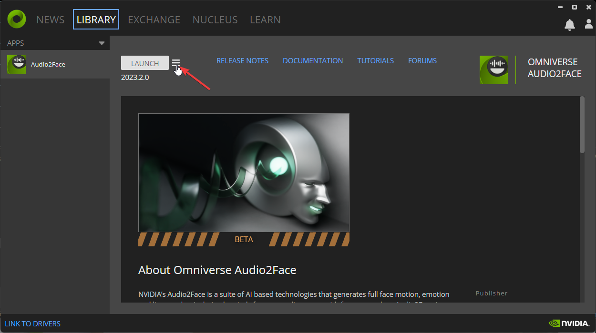
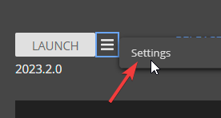
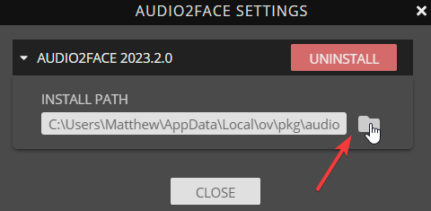
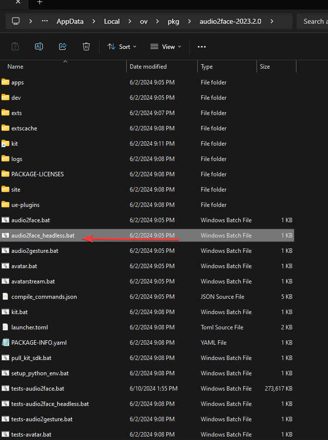
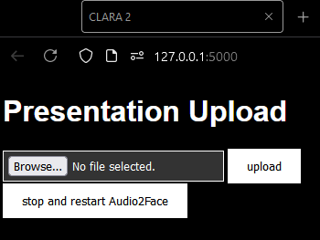

# CLARA 2 (**C**omprehensive **L**earning **A**nd **R**eview **A**gent)

CLARA 2 allows users to create AI presentations from a PowerPoint file.

## Overview

CLARA 2 is my submission for the [Generative AI Agents Developer Contest by NVIDIA and LangChain](https://www.nvidia.com/en-in/ai-data-science/generative-ai/developer-contest-with-langchain/).

- CLARA 2 uses a Langchain-orchestrated NVIDIA NIM `mixtral-8x22b` API call to process data extracted from PowerPoint slides.
- The Mixtral response is passed to a Google/ElevenLabs TTS, and the generated `.wav` audio is in turn passed to Audio2Face.
- Audio2Face, using LiveLink, streams the audio and animation data into Unreal Engine 5 to generate a real-time rendition of an AI MetaHuman presenter.
- Thanks to LangChain’s role in abstracting NVIDIA NIM API calls, CLARA 2's LLM can easily be swapped out with minimal changes to the source code. In other words, as LLMs get bigger, better, and faster, so can CLARA 2.

Check out the quick demo video for CLARA 2 here:

- **Fun fact**: the AI CLARA 2 presenter in the demo video is the mesh and voice of the real Clara that this project was named after!

If you want a more detailed technical breakdown of how CLARA 2 works, check out [ARCHITECTURE.md](docs/ARCHITECTURE.md).

## Quickstart

**Pre-requisites**: Windows OS, WSL Ubuntu, Python 3.11.9 (other minor/micro versions will likely work, but I have only tested 3.11.9)

1. Install Audio2Face from NVIDIA Omniverse.
2. Launch Audio2Face as a headless server by clicking the hamburger icon pictured below:

    

3. Click settings:

    

4. Click the folder icon:

    

5. Launch `audio2face_headless.bat` using your favorite Windows shell:

    

6. Launch Unreal Engine `CLARA2.exe` binary.

- NOTE: `CLARA2.exe`, where all the configuration you see in the demo video is baked into the build, is not packaged with this repo. If you want to set up CLARA 2 on your own rig/with your own MetaHuman, you'll need to:

  - create your own MetaHuman here: metahuman.unrealengine.com
  - install Unreal Engine 5.3
  - install the following Unreal Engine plugins:
  
    - Audio2Face
    - LiveLink
    - MetaHuman

  - import your created MetaHuman using Quixel Bridge and selecting `My Metahumans`

  - configure LiveLink to listen for Audio2Face within your LiveLink settings

7. Now that Audio2Face is running in Windows and the Unreal Engine `CLARA.exe` running and listening using LiveLink, send the following requests to the A2F server REST endpoints using `curl` or your favorite HTTP request tool:

    ```bash
    curl -X 'POST' \
      "http://${HOST_IP_ADDRESS}:8011/A2F/USD/Load" \
      -H 'accept: application/json' \
      -H 'Content-Type: application/json' \
      -d '{
      "file_name": "<windows_drive_letter>:/<your_path_to_this_repo>/config_files/unreal_streaming.usd"
    }'
    ```

    - replace `${HOST_IP_ADDRESS}` with your PC's IPV4 address. when using WSL Ubuntu, I plop the following into my `~/.bashrc` file dynamically fetch/store my correct IP when I launch Bash:

      ```bash
        export HOST_IP_ADDRESS=$(ip route | grep default | awk '{print $3}')
      ```

    - on my computer, the above command has the following value for the `file_name` field: `"C:/Users/Matthew/Desktop/CLARA2/unreal_streaming.usd"`.

    ```bash
    curl -X 'POST' \
      "http://${HOST_IP_ADDRESS}:8011/A2F/Exporter/ActivateStreamLivelink" \
      -H 'accept: application/json' \
      -H 'Content-Type: application/json' \
      -d '{
      "node_path": "/World/audio2face/StreamLivelink",
      "value": true
    }'
    ```

That's it for initial setup! Now, let's get to using CLARA 2:

1. If you haven't already, install WSL Ubuntu and Python 3.11.9.
2. Set the following environment variables in your current shell OR in `.bashrc` so that CLARA 2 can use TTS, the NVIDIA NIM API, and so that the Python modules are aware of one another:

    ```bash
    export GOOGLE_APPLICATION_CREDENTIALS="/path/to/your/service-account-file.json" # use this for Google TTS
    export ELEVEN_API_KEY="your_elevenlabs_api_key" # use this for ElevenLabs TTS
    export NVIDIA_API_KEY="your_NVIDIA_NIM_API_key"
    export PYTHONPATH=$PYTHONPATH:/<your_linux_path_to_this_CLARA2_repo>
    ```

3. Install the required Ubuntu packages:

    ```bash
    sudo apt update
    sudo apt install -y libgl1-mesa-glx libglib2.0-0 libsm6 libxrender1 libfontconfig1 tesseract-ocr libreoffice imagemagick
    ```

4. Install the required python packages by running the following in the CLARA2 directory: `pip install -r requirements.txt`

5. Using WSL Ubuntu, navigate to the root directory of this repo, and run the following commands in Bash to launch CLARA 2:

- `chmod +x CLARA2.sh`
- `./CLARA2.sh`

You'll see a web page pop up in your default web browser that prompts you to upload your PowerPoint:



Select your PowerPoint file, hit the `upload` button, and wait while CLARA2 generates your presentation.

Once CLARA 2 finishes generating your content, the presentation will automatically begin.
